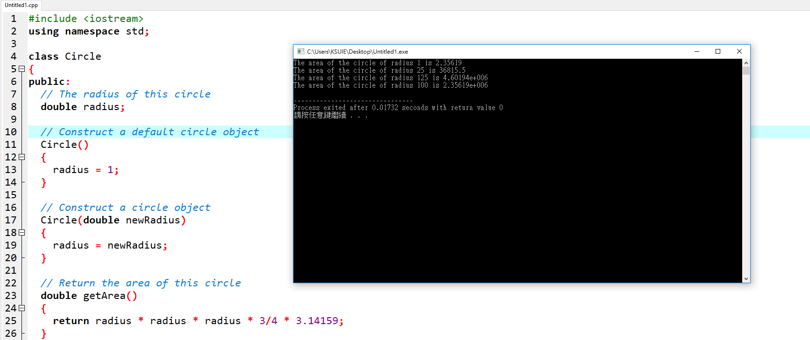

#include <iostream> //載入相關模組  
using namespace std; //使用<標準>命名空間

class Circle //建構形狀
{
public: //大眾用法
  // The radius of this circle
  double radius;

  // Construct a default circle object
  Circle()
  {
    radius = 1;
  }

  // Construct a circle object
  Circle(double newRadius)
  {
    radius = newRadius;
  }

  // Return the area of this circle
  double getArea()
  {
   return radius * radius * radius * 3/4 * 3.14159; //圓體積算法
  }
};  // Must place a semicolon here

int main()
{
  Circle circle1(1);  //建立10個物件
  Circle circle2(2);
  Circle circle3(3);
  Circle circle4(4);
  Circle circle5(5);
  Circle circle6(6);
  Circle circle7(7);
  Circle circle8(8);
  Circle circle9(9);
  Circle circle10(10);

  cout << "半徑為 "  
  << circle1.radius << " is " << circle1.getArea() << endl;
  
  cout << "The area of the circle of radius "
    << circle2.radius << " is " << circle2.getArea() << endl;
    
  cout << "The area of the circle of radius "
    << circle3.radius << " is " << circle3.getArea() << endl;
    
    cout << "The area of the circle of radius "  
  << circle4.radius << " is " << circle4.getArea() << endl;
  
  cout << "The area of the circle of radius "
    << circle5.radius << " is " << circle5.getArea() << endl;
  cout << "The area of the circle of radius "
    << circle6.radius << " is " << circle6.getArea() << endl;
    
    
    
    
    
    
    

  // Modify circle radius
  circle2.radius = 100;
  cout << "The area of the circle of radius "
    << circle2.radius << " is " << circle2.getArea() << endl;

  return 0;
}
//還未完成
---

